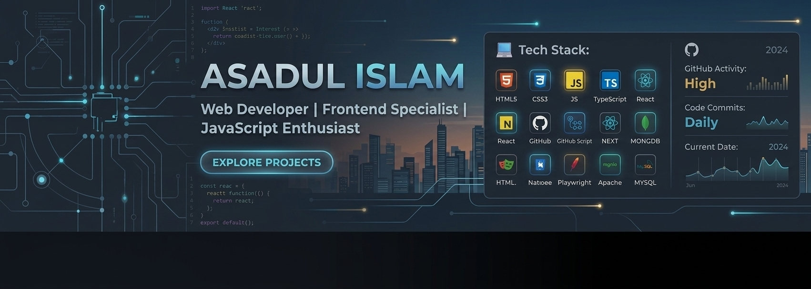

# Hi there 👋, I'm Asadul Islam

### 💻 Web Developer | Frontend Developer | JavaScript Enthusiast

I'm a passionate Web Developer who loves building modern, responsive, and user-friendly web applications.

- 🔭 I’m currently working on web development projects
- 🌱 I’m currently learning **React.js, Node.js & Full-Stack Development**
- 💻 I enjoy building **responsive and interactive web applications**
- 🛠️ I work with **HTML, CSS, JavaScript, React.js**
- 🚀 I'm continuously improving my coding and problem-solving skills
- 👯 I’m looking to collaborate on **Web Development Projects**
- 💬 Ask me about **HTML, CSS, JavaScript, React & Web Development**
- 📫 How to reach me: **asadulislam.dev@gmail.com**

# 💻 Tech Stack:
            
# 📊 GitHub Stats:
 
 

### ✍️ Random Dev Quote

### 🔝 Top Contributed Repo

---

<!-- Proudly created with GPRM ( https://gprm.itsvg.in ) -->
